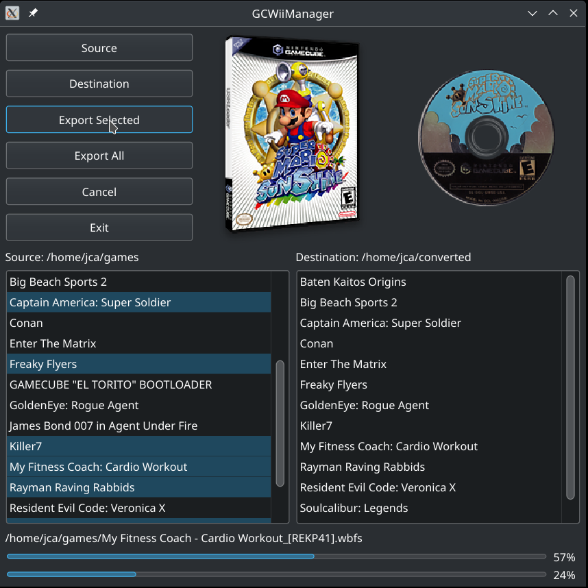

# GCWiiManager

Tool to export GameCube and Wii games to external hard disk.

Files supported: ISO, WBFS.



### Requirements

* Python3

### Installation of dependencies
Dependency list is has been generated with `pipreqs` and can be installed using `pip`
```
pip install -r requirements.txt
```


### Start the program
```
python3 Start.py
```

